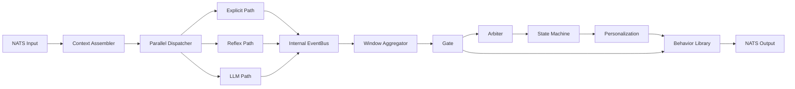

# volta-brain 技术架构

## 1. 目标

`volta-brain` 不是 `robo-brain` 的业务复制品，而是一个仅保留结构节点和数据流的纯净骨架：

- 不保留 ROS topic 细节
- 不保留 rosbridge 协议细节
- 不保留具体感知 schema、规则和动作逻辑
- 只保留架构节点、消息契约和链路闭环

## 2. 技术选型

- 外部消息边界：`NATS`，使用 `github.com/nats-io/nats.go`
- 内部事件总线：`Watermill + GoChannel`
- 节点装配：自研 `runtime`，显式注册节点
- 状态仓：进程内 `state.Store`
- 测试边界：`MemoryBus` 模拟 NATS，覆盖 unit + e2e

## 3. 为什么这样分层

### 外层用 NATS

`volta-brain` 的输入输出都面向系统边界，因此统一由 NATS 承担：

- 输入进来走 `volta.input.frame`
- 输出往外发 `pipeline/action/state_machine/state`

这意味着 `volta-brain` 本体不需要再理解：

- ROS topic 命名
- rosbridge WebSocket 报文
- ROS service 调用细节

如果未来仍需接 ROS，应在外部单独做 `ros <-> nats bridge`，而不是把桥接耦回 brain。

### 内层用 Watermill

内部节点之间仍保留 `Watermill GoChannel`，原因是：

- 与 `robo-brain` 当前内部总线思路一致
- 不需要把每个内部 hop 都外部化到 broker
- 单进程下延迟低，测试简单
- 节点的职责边界比 goroutine/channel 散写更清晰

## 4. 结构节点

## 5. 上下文仓

图里的三类上文在 `volta-brain` 中保留为空壳 snapshot：

- `PersonalityShell`
- `MemoryShell`
- `InternalStateShell`

它们只负责占位和连线，不携带任何具体业务字段。

## 6. 输出契约

对外只发布四类消息：

- `volta.output.pipeline`
- `volta.output.action`
- `volta.output.state_machine`
- `volta.output.state`

这样外部系统只需要关注结构化事件，而不需要侵入内部节点实现。
